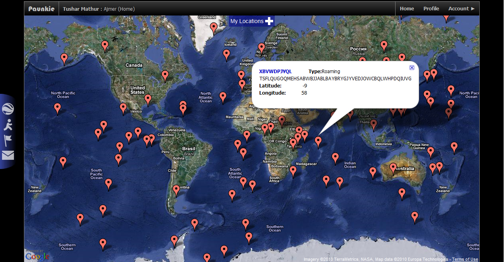
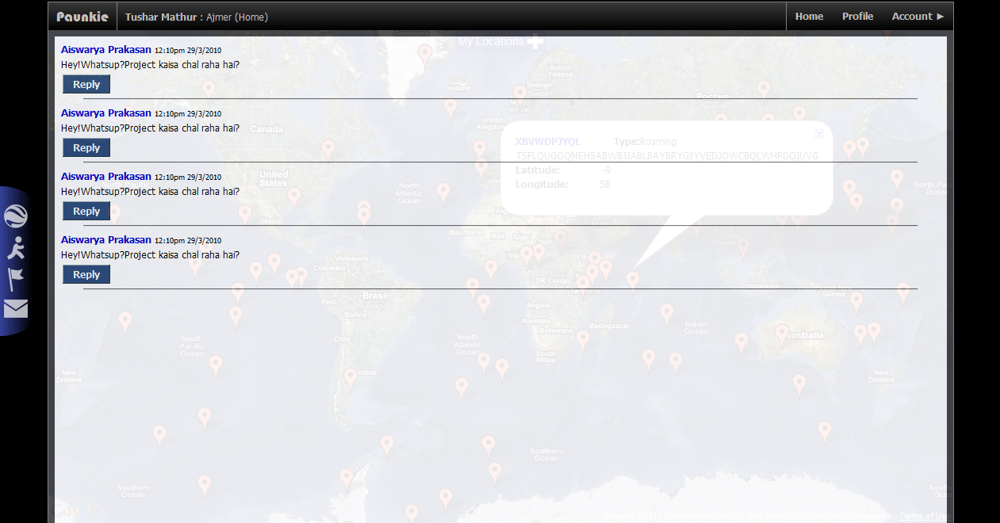
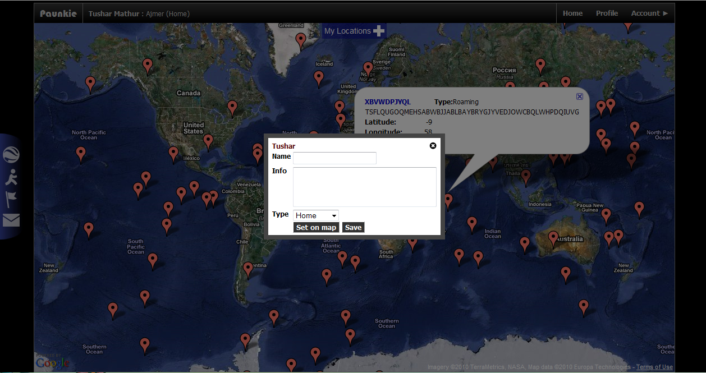
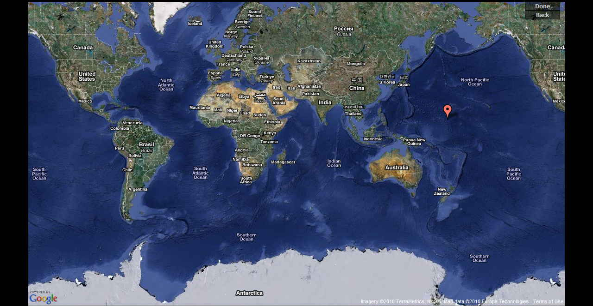

```metadata
title: Geocode your life
author: tushar-mathur
date: 2013-oct-17
template: project.jade
category: project
```
I wanted to write this blog about one of my undergrad projects — **Paunkie**. A social networking website which was based on maps. We were a team of two undergrad students who were being mentored by Prof. Vaishali Dharkar as our guide for this project. It was inspired by [Serenedipity](https://indigoarchitects.com/CaseStudy/Mobile_Serendipity.aspx), one of [Indigo Architects](http://indigoarchitects.com/) niche products. I was able to convince my partner and our project guide that it was a cool idea to build something on similar lines and that it would definitely qualify for a research project.

<span class="more"/>

The concept of **Paunkie** was to *Geocode your life*. Basically, everything and anything you did or your friends did, could be pinned on to a map and shared within your social circle. The two key components of the application were the user interface that was designed to be aesthetically acceptable and responsive to various screen sizes, and the [k-means clustering algorithms](en.wikipedia.org/wiki/K-means_algorithm) that generated recommendations in real time.

We barely had the time to prototype the concept and were far away from building a production ready application. Later we realised that no one really builds a **Production Ready** product until its actually pushed to production :D

Some time back when I was going through my archives, I found a couple of snapshots of this application —

 Everything that you might be interested in on the map, based on what you and your friends have been up to.

 No social networking application is complete without a messaging feature.


 Adding a new location of interest to share with your friends.


 You current location (in the middle of the Pacific Ocean).