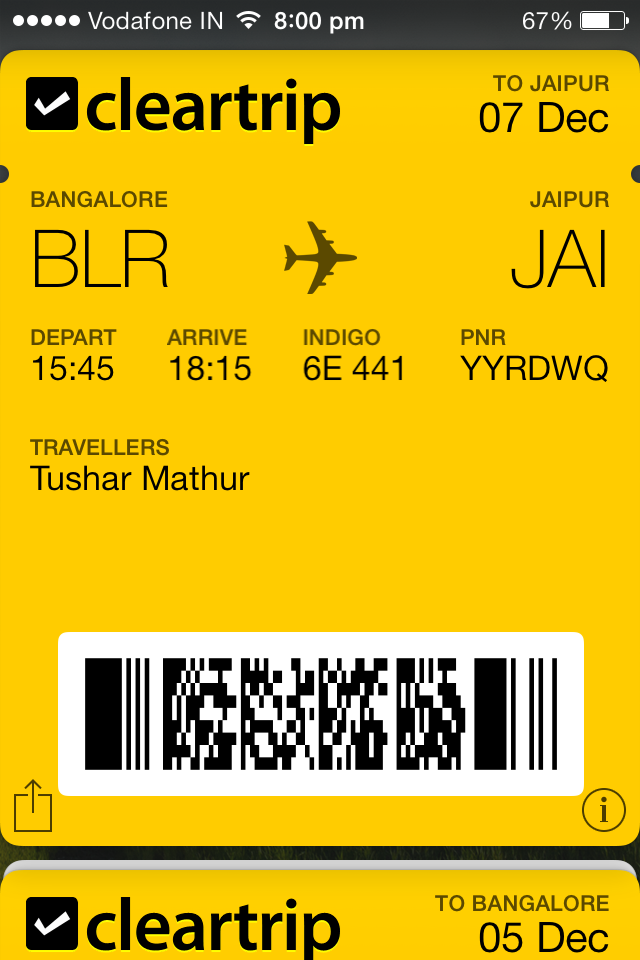

```metadata
title: Using Passbook at Indian Airports

date: 2013-dec-5
template: article.pug
```

Apple's passbook is something that I was not expecting to work in India anytime soon. I was travelling to Bangalore, and decided to test this time if the app has any credibility, in the eyes of the security at the Jaipur International Airport, my boarding point.

<span class="more" />


I had booked the ticket using Cleartrip, which automatically sends a passbook supported ePass to your email-id, once its confirmed. I loaded it into my iPhone which was easy and headed for the airport. The interesting thing is that BCAS had already issued a notice last year (2012) allowing people to travel without a printed ticket. Of course e-ticket is not the same as an ePass but I wanted to see if the Airports had actually implemented this facility for their passengers, since there was no strict deadline specified in the notice for the airports. They claim that the delay in implementing this facility for the passengers is that the security people need to undergo special training for this kind of a setup. I wondered why? Is it so different than paper based version of authorisation?

I thought it would be better to call the Airlines first and confirm if they accept ePasses or eTickets. I called SpiceJet and then I called Indigo Airlines to confirm, both of them din't even understand what I was saying in the first place. I gave them the link to the BCAS's [notice](http://www.bcasindia.nic.in/cir_nonrestrict/notice/eticket.pdf), and both of them were adamant about one thing - 'We are not aware about this update from BCAS and it would be better if you take a printout ticket with you, else you will not be given a boarding pass, in fact no one would even let you in the airport'. There was nothing in 'my' hands, I had to go and get a printout late at night that day. I appreciated the fact that they at least din't deny the existence of BCAS.

One of my characteristics is 'perseverance', so I decided that I would go and show the ePass first and incase someone doesn't want my life to be little too easy (trust me, I've met a lot of such people), I would show him the printed version. With this plan in mind, I arrived at the Jaipur airport around an hour prior to the departure time and to my astonishment - my GPS location had already triggered my passbook app, sending a notification, and making the ticket available on my lock screen! I now had access to the ticket on the lock screen itself and thats not it, the brightness of the phone would automatically go up to its max when ever I opened the ticket, making it easier to read in broad day light!

I showed the passbook ticket to the sentry at the main gate, she looked at it for sometime. Confused a little, she asked for my id-card. I gave it to her, then another 10 seconds passed, she din't even look at me and said 'Go'. I thought that I might have confused her or may be it was a fluke, may be the next sentry won't. The next one also saw the ePass and gave a go ahead. I was a little too excited, first of all because people were finally accepting technology in India and I din't have to run to get a printout before boarding a flight ever again! I wondered if Indigo Airlines would give me my boarding pass on the basis of my ePass because the customer support was pretty assertive about not having this facility.

I went to the Indigo Airline's counter and showed him the epass. He asked for an id, I gave it to him, he cracked a joke i think on my photo-id, which I din't care to hear, but smiled nevertheless. Whoo hoo! I got my boarding pass without needing to use the printed version. This was an awesome experience, I love it when people adopt technology to make life simpler. What do I say about the customer support? Should I call again and tell them?

**Update:** The ePass worked at the Bangalore Airport also.

---

# Creating your own ePass

I have built a [template](https://pass.is/ToLUhtxK07otOTO) on [passkit.com](http://passkit.com) which can be used for generating ePasses conveniently. You can use the template to create a new pass or scan the QR code below with your passbook app directly.


Unfortunately I don't have an enterprise account with passkit, so I can only have a maximum of 10 passes at any given period of time. Please make sure to delete the passes once you are done using them.
